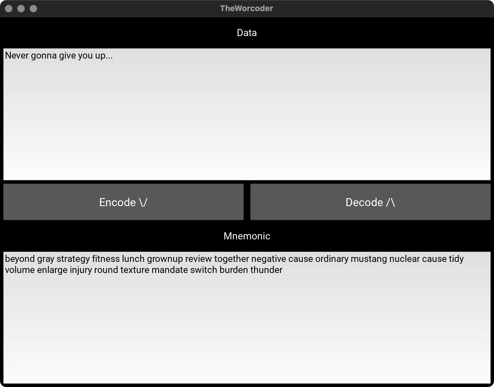

# TheWorcoder

A simple application that converts data into mnemonic words (using the [worcoder](https://github.com/jooray/worcoder) library) and vice versa, including a checksum to catch errors. This app is designed to be run on desktop (macOS, Linux, Windows) and can also be packaged for Android (and iOS) using tools like [Buildozer](https://github.com/kivy/buildozer) or [Xcode Kivy-ios](https://kivy.org/doc/stable/guide/packaging-ios.html).

The mnemonic format and wordlist is from [python-shamir-mnemonic](https://github.com/trezor/python-shamir-mnemonic), parts of the code used under MIT license.

Uses the [worcoder python library](https://github.com/jooray/worcoder)

Compatible implementations:
JavaScript library: [worcoder-js](https://github.com/jooray/worcoder-js)
Progressive Web App: [deployed](https://cypherpunk.today/theworcoder/index.html), source:[theworcoder-pwa](https://github.com/jooray/theworcoder-pwa)


## Screenshot



## Prerequisites

1. [Python 3.7+](https://www.python.org/)
2. [Poetry](https://python-poetry.org/docs/)
3. (Optionally) [Buildozer](https://kivy.org/doc/stable/guide/packaging-android.html) for Android builds

## Installation

1. **Clone this repository** using --recurse-submodules

   ```bash
   git clone --recurse-submodules https://github.com/jooray/theworcoder-desktop
   ```

2. In the `theworcoder-desktop` directory, install dependencies via Poetry:
   ```bash
   poetry install
   ```
   This will create a new virtual environment with Kivy and worcoder installed.

## Usage (Desktop)

After the above steps, simply run:

```bash
poetry run python main.py
```

You should see the main window appear

## Encoding/Decoding Data

1. **Encode**: Type something into the **Data** text area, then click the **Encode ↓** button to encode the data into a mnemonic. The result is copied to the clipboard.
2. **Decode**: Paste a mnemonic into the **Mnemonic** text area, then click **Decode ↑** to decode back into data. The data is copied to the clipboard.

## Building for Android (not tested)

To build for Android, you can use the [Buildozer](https://github.com/kivy/buildozer) tool. Steps:

1. Install buildozer globally (outside the poetry venv), for example:
   ```bash
   pip install buildozer
   ```
   or  
   ```bash
   python -m pip install buildozer
   ```
2. From inside the `theworcoder` directory, initialize buildozer:
   ```bash
   buildozer init
   ```
   This creates a `buildozer.spec` file.
3. Edit `buildozer.spec` to reflect your app’s requirements. Make sure it includes Kivy and references your `main.py`.
4. Then run:
   ```bash
   buildozer android debug
   ```
   This will download the Android SDK/NDK and build the `.apk`.  
   You can use:
   ```bash
   buildozer android debug deploy run
   ```
   to install and run on a connected device or emulator.

## Building for iOS (not tested)

Packaging for iOS is more involved. The typical flow uses [kivy-ios](https://kivy.org/doc/stable/guide/packaging-ios.html) and Xcode:

1. Clone [kivy-ios](https://github.com/kivy/kivy-ios).
2. Use its toolchain to build Python, Kivy, and your app’s dependencies.
3. Create an Xcode project and integrate the compiled frameworks.
4. Build and deploy to iOS device or simulator from Xcode.
